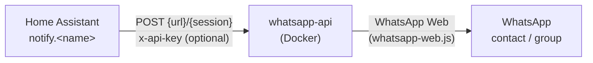

# wapi-custom-notifier

[](https://github.com/hacs/integration)
[](https://github.com/t0mer/wapi-custom-notifier/releases)
[](https://github.com/t0mer/wapi-custom-notifier/blob/main/LICENSE)

**wapi-custom-notifier** is a [Home Assistant](https://www.home-assistant.io/) custom notify integration (domain `wapi`) that sends WhatsApp messages to contacts and groups through a self-hosted [whatsapp-api](https://github.com/chrishubert/whatsapp-api) server. You don't need the official WhatsApp Cloud API or a third-party messaging provider: the messages go out from a regular WhatsApp account linked to your own whatsapp-api instance.

[whatsapp-api](https://github.com/chrishubert/whatsapp-api) by [chrishubert](https://github.com/chrishubert) is a REST API wrapper for the [whatsapp-web.js](https://github.com/pedroslopez/whatsapp-web.js) library. It runs as a Docker container and exposes the WhatsApp Web platform over HTTP. This integration is a thin client for its `sendMessage` endpoint.

> [!IMPORTANT]
> - This project is **not affiliated with, endorsed by, or supported by WhatsApp or Meta**.
> - whatsapp-api and whatsapp-web.js are unofficial WhatsApp Web clients. Using an unofficial client may violate [WhatsApp's Terms of Service](https://www.whatsapp.com/legal/terms-of-service) and can get the linked number banned. Use it at your own risk, preferably with a dedicated number.
> - The upstream [chrishubert/whatsapp-api](https://github.com/chrishubert/whatsapp-api) repository is **archived** on GitHub (read-only, last push December 2025). It no longer receives updates, and future WhatsApp Web changes may break it. Upstream marks itself deprecated and points to the maintained fork [avoylenko/wwebjs-api](https://github.com/avoylenko/wwebjs-api); compatibility of this integration with that fork has not been verified.

## Table of contents

- [Features](#features)
- [How it works](#how-it-works)
- [Requirements](#requirements)
- [Setting up whatsapp-api](#setting-up-whatsapp-api)
- [Installation](#installation)
- [Configuration](#configuration)
- [Usage](#usage)
- [Limitations](#limitations)
- [Troubleshooting](#troubleshooting)
- [Security notes](#security-notes)
- [Contributing](#contributing)
- [License](#license)

## Features

- Legacy Home Assistant `notify` platform, configured in `configuration.yaml`.
- Sends text messages to a WhatsApp **contact** (`…@c.us`) or **group** (`…@g.us`).
- The notification `title` is prepended to the message in bold (`*title*`, WhatsApp formatting).
- Sends **media from URLs** (images, videos, and other files): pass one or more URLs in `data.media_url`, one per line. Each URL is sent as a separate message after the text.
- Optional API key, sent in the `x-api-key` header, for whatsapp-api servers with `API_KEY` enabled.
- Multiple notifiers: add several `wapi` platform entries (for example, one per whatsapp-api session), each with its own `name`.

## How it works



When a `notify.<name>` service is called, the integration makes one HTTP `POST` request to `{url}/{session}` (for example `http://whatsapp-api:3000/client/sendMessage/ABCD`) with this JSON body. Home Assistant always turns `target` into a list, and the integration forwards it unchanged, so `chatId` is sent as an array (upstream documents `chatId` as a string):

```json
{
  "chatId": ["972500000000@c.us"],
  "contentType": "string",
  "content": "*Title* \nMessage text"
}
```

For every URL in `data.media_url` it makes another request to the same endpoint:

```json
{
  "chatId": ["972500000000@c.us"],
  "contentType": "MessageMediaFromURL",
  "content": "https://example.com/snapshot.jpg"
}
```

If `token` is configured, each request carries the header `x-api-key: <token>`.

## Requirements

- Home Assistant with support for legacy (YAML) `notify` platforms. <!-- TODO: verify minimum and current supported Home Assistant version; neither hacs.json nor manifest.json declares one -->
- [HACS](https://hacs.xyz/) (optional, for the HACS installation method).
- A running [whatsapp-api](https://github.com/chrishubert/whatsapp-api) server that Home Assistant can reach over HTTP, with an authenticated session (a WhatsApp account linked by scanning a QR code).
- A WhatsApp account for the session. A separate number is recommended (see [Limitations](#limitations)).

The integration depends on the Python `requests` package (declared in `manifest.json`).

## Setting up whatsapp-api

The steps below are a quick start. The upstream [whatsapp-api README](https://github.com/chrishubert/whatsapp-api) is the authoritative reference for its settings.

1. Create a `docker-compose.yaml` file with the following content:

   ```yaml
   services:
     app:
       container_name: whatsapp_web_api
       image: chrishubert/whatsapp-web-api:latest # Pull the image from Docker Hub
       # restart: always
       ports:
         - "3000:3000"
       environment:
         #- API_KEY= # Optional. Recommended in production; use the same value as `token` in Home Assistant
         - BASE_WEBHOOK_URL=http://localhost:3000/localCallbackExample
         - ENABLE_LOCAL_CALLBACK_EXAMPLE=TRUE # OPTIONAL, NOT RECOMMENDED FOR PRODUCTION. Remove after the QR scan
         - MAX_ATTACHMENT_SIZE=5000000 # IN BYTES
         - SET_MESSAGES_AS_SEEN=FALSE # WILL NOT MARK THE MESSAGES AS READ AUTOMATICALLY
         # ALL CALLBACKS: auth_failure|authenticated|call|change_state|disconnected|group_join|group_leave|group_update|loading_screen|media_uploaded|message|message_ack|message_create|message_reaction|message_revoke_everyone|qr|ready|contact_changed
         - DISABLED_CALLBACKS=message_ack # PREVENT SENDING CERTAIN TYPES OF CALLBACKS BACK TO THE WEBHOOK
         - ENABLE_SWAGGER_ENDPOINT=TRUE # When enabled, adding "/api-docs" to the URL opens Swagger.
       volumes:
         - ./sessions:/usr/src/app/sessions # Mount the local ./sessions/ folder to the container's /usr/src/app/sessions folder
   ```

2. Start the container:

   ```bash
   docker compose pull && docker compose up
   ```

3. Start a session by visiting `http://localhost:3000/session/start/ABCD` (replace `ABCD` with your session name). You will use the same name as `session` in Home Assistant.

4. Scan the QR code shown in the container console with the WhatsApp mobile app: **Settings → Linked devices → Link a device**. Setting up the session may take a while.

5. Find the chat IDs by visiting `http://localhost:3000/client/getContacts/ABCD` (replace `ABCD` with your session name). It lists all contacts and group chats in JSON format. The `id._serialized` value is the chat ID to use as `target`:

   ```json
   {
       "success": true,
       "contacts": [
           {
               "id": {
                   "server": "g.us",
                   "user": "123456789-987654321",
                   "_serialized": "123456789-987654321@g.us"
               },
               "number": null,
               "isBusiness": false,
               "isEnterprise": false,
               "name": "Family",
               "type": "in",
               "isMe": false,
               "isUser": false,
               "isGroup": true,
               "isWAContact": false,
               "isMyContact": false,
               "isBlocked": false
           }
       ]
   }
   ```

6. Optional: with the local callback example enabled, all callback data is logged to `./sessions/message_log.txt`.

## Installation

### HACS (custom repository)

The integration is not in the HACS default repository list, so add it as a custom repository:

1. In Home Assistant, open **HACS**.
2. In the upper right corner, click the three dots and select **Custom repositories**.
3. Under **Repository**, paste `https://github.com/t0mer/wapi-custom-notifier`.
4. Under **Type** (category), select **Integration** and click **Add**.
5. Search HACS for **wapi custom whatsapp notifications** and download it.
6. Restart Home Assistant.

### Manual

1. Download the latest [release](https://github.com/t0mer/wapi-custom-notifier/releases) (or clone the repository).
2. Copy the `custom_components/wapi` folder into the `custom_components` folder of your Home Assistant configuration directory, so you end up with `<config>/custom_components/wapi/notify.py`.
3. Restart Home Assistant.

## Configuration

The integration is configured **only in YAML**. There is no config flow (UI setup). Add a `notify` platform entry to `configuration.yaml`:

```yaml
notify:
  - platform: wapi
    name: whatsapp
    url: http://192.168.1.10:3000/client/sendMessage
    session: ABCD
    token: !secret wapi_api_key # Optional
```

`secrets.yaml`:

```yaml
wapi_api_key: "your-whatsapp-api-key"
```

Restart Home Assistant after changing the configuration.

| Key | Required | Default | Description |
|-----|----------|---------|-------------|
| `platform` | yes | | Must be `wapi`. |
| `name` | no | `notify` | Name of the notifier. The service is `notify.<name>` in snake case (for example, `name: whatsapp` creates `notify.whatsapp`). Without `name`, Home Assistant creates `notify.notify`, which is easy to confuse with other notifiers, so always set it. This key comes from Home Assistant's notify platform. |
| `url` | yes | | Full URL of the whatsapp-api send endpoint, **without** the session, for example `http://192.168.1.10:3000/client/sendMessage`. The integration appends `/<session>` to it. |
| `session` | yes | | The whatsapp-api session ID you started and linked (for example `ABCD`). |
| `token` | no | not sent | API key of the whatsapp-api server (its `API_KEY` setting). Sent as the `x-api-key` header. Leave it out if the server has no API key. |

To send from several WhatsApp accounts, add one entry per session with different `name` values.

## Usage

### Service data

| Field | Required | Description |
|-------|----------|-------------|
| `message` | yes | The message text. |
| `title` | yes, in practice | Shown in bold above the message. The current code fails if it is missing (see [Troubleshooting](#troubleshooting)). |
| `target` | yes | Chat ID of a contact (`972500000000@c.us`: country code and number, digits only) or a group (`123456789-987654321@g.us`). Use one chat ID per call. Several targets are sent as one array in a single request, not one message per target. |
| `data.media_url` | no | One or more media URLs, one per line. Each URL is sent as its own message after the text. The **whatsapp-api server** downloads the file, so the URL must be reachable from that container. |

### Test from Developer tools

In Home Assistant, go to **Developer tools → Actions** (called **Services** in older versions), pick `notify.whatsapp`, switch to YAML mode, and enter:

```yaml
action: notify.whatsapp
data:
  title: Your Garage Door Friend
  message: The garage door has been open for 10 minutes.
  target: 972500000000@c.us
```

Then click **Perform action**. Older Home Assistant versions use `service:` instead of `action:`.

### Send to a group

```yaml
action: notify.whatsapp
data:
  title: Home
  message: Everyone has left the house.
  target: 123456789-987654321@g.us
```

### Send media

Use a YAML multi-line string (`|`) to send several files:

```yaml
action: notify.whatsapp
data:
  title: Your Garage Door Friend
  message: The garage door has been open for 10 minutes.
  target: 972500000000@c.us
  data:
    media_url: |
      https://api.qrserver.com/v1/create-qr-code/?size=150x150&data=Example
      https://api.qrserver.com/v1/create-qr-code/?size=150x150&data=Example2
```

### Automation example

```yaml
automation:
  - alias: Garage door left open
    triggers:
      - trigger: state
        entity_id: cover.garage_door
        to: "open"
        for: "00:10:00"
    actions:
      - action: notify.whatsapp
        data:
          title: Garage
          message: The garage door has been open for 10 minutes.
          target: 123456789-987654321@g.us
```

## Limitations

- If the linked number sends to itself, WhatsApp treats it as a note to yourself and shows no alert. Link a different number to whatsapp-api to receive pop-up notifications on your own phone.
- Only text and media-from-URL messages are supported. Media is sent without a caption, as separate messages after the text.
- The integration does not check whether the whatsapp-api session is connected. Failures (connection errors or 4xx/5xx responses) are only written to the Home Assistant log; the action itself still succeeds, so automations don't see the error.

## Troubleshooting

Errors are logged by the `custom_components.wapi.notify` logger. To see more detail, enable debug logging:

```yaml
logger:
  default: warning
  logs:
    custom_components.wapi: debug
```

- **`Error sending notification using wapi: …`**: the HTTP request failed or whatsapp-api returned an error status (4xx/5xx). Check that:
  - `url` ends with `/client/sendMessage` and does **not** include the session (the session is appended automatically);
  - the session is started and linked (scan the QR code again if it was logged out);
  - `token` matches the server's `API_KEY` (a wrong or missing key causes an authorization error);
  - Home Assistant can reach the whatsapp-api host and port.
- **`Message sent` is logged, but nothing arrives**: this INFO line is written after the request, before the status code is checked, so it doesn't mean the send succeeded. Check for an error line right after it and the whatsapp-api container logs.
- **`TypeError` about `str` and `NoneType`** when calling the service: `title` is missing. Always pass a `title`.
- **`KeyError: 'media_url'`**: you passed `data` without a `media_url` key (for example `data: {}`, or `data` with other keys only). Remove `data`, or add `media_url`.
- **Media doesn't arrive**: the whatsapp-api container must be able to download the URL.
- **Service `notify.<name>` doesn't exist**: restart Home Assistant after installing the integration and after editing `configuration.yaml`, and check the log for configuration errors (`url` and `session` are required).
- **Actions hang**: requests are made without a timeout, so an unreachable server can keep the call waiting until the connection times out.

## Security notes

- Keep the API key in `secrets.yaml` (`token: !secret wapi_api_key`) instead of writing it in `configuration.yaml`, and keep `secrets.yaml` out of version control and shared backups.
- Enable `API_KEY` on whatsapp-api. Without it, anyone who can reach the server can send messages as your WhatsApp account.
- Don't expose the whatsapp-api port to the internet. Keep it on your LAN or a private Docker network reachable by Home Assistant only. The integration talks to it over plain HTTP unless you put it behind TLS.
- Disable `ENABLE_LOCAL_CALLBACK_EXAMPLE` and `ENABLE_SWAGGER_ENDPOINT` after setup.
- The `./sessions` folder holds the linked WhatsApp session. Anyone with a copy of it can act as that account, so protect it like a password.

## Contributing

Bug reports and pull requests are welcome on [GitHub](https://github.com/t0mer/wapi-custom-notifier/issues). To test a change, copy `custom_components/wapi` into a development Home Assistant instance, restart it, and call the notify service against a whatsapp-api test session.

## License

Released under the [MIT License](https://github.com/t0mer/wapi-custom-notifier/blob/main/LICENSE). Copyright (c) 2023 Tomer Klein.

whatsapp-api and whatsapp-web.js are separate projects with their own licenses.
